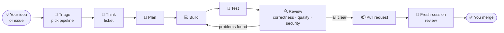
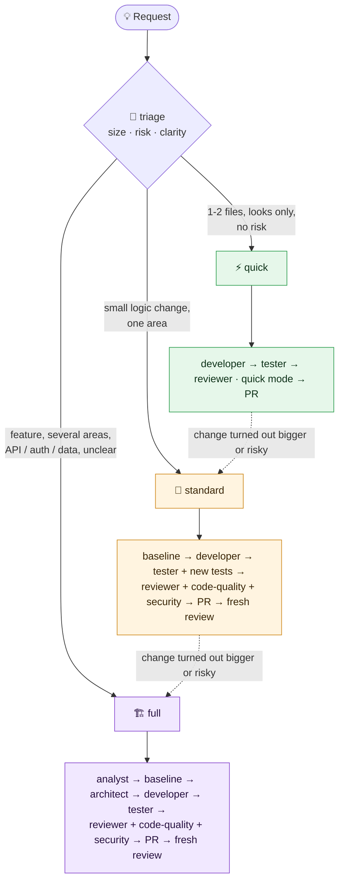
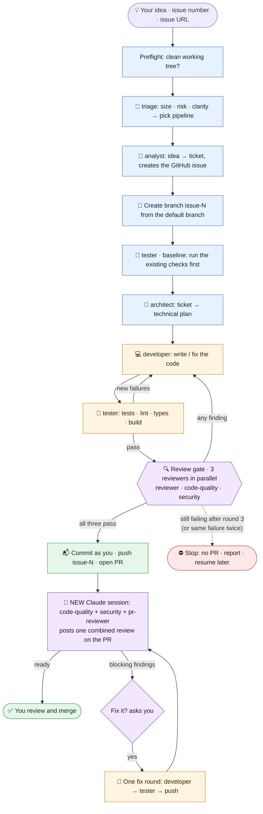
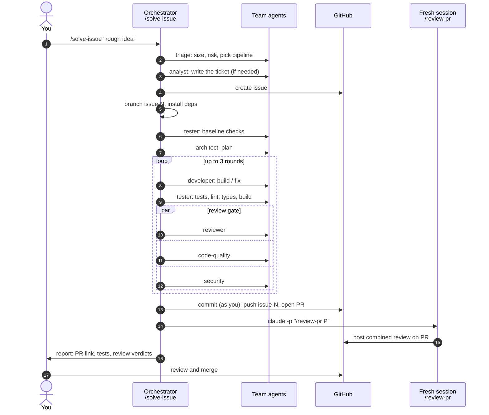
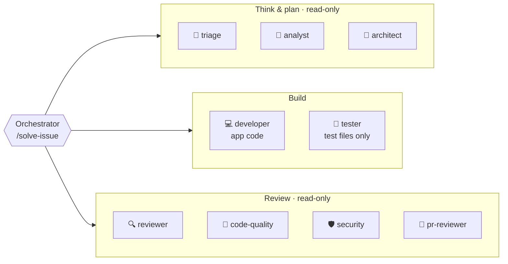
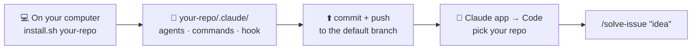
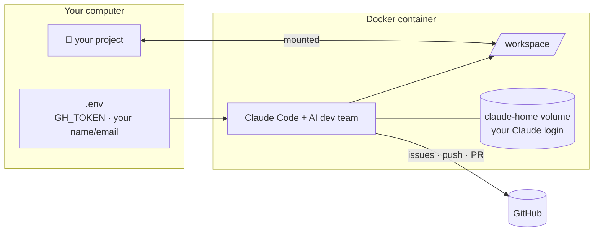
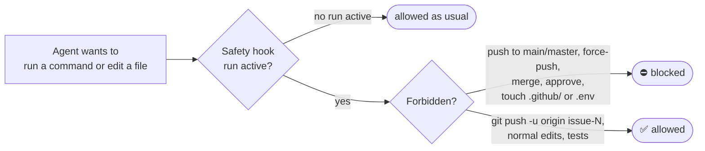

# AI Dev Team for Claude Code

**Give it a rough idea or a GitHub issue. Get back a tested, reviewed pull request.**

```
/solve-issue "users should be able to mark items as favourite"
```

A team of Claude Code agents does the work. A **triage** agent first sizes the task and picks the right pipeline, so a colour tweak takes a few steps and a new feature gets the full process. Then one thinks the idea through, one plans, one codes, one tests, and up to three review the result (correctness, code quality, security). After the PR opens, a **separate, fresh session** reviews it again with no memory of how it was built. Everything runs on your machine, in your repository, and commits are made **as you**.

---

## Contents

1. [How it works in 30 seconds](#how-it-works-in-30-seconds)
2. [Quick start](#quick-start)
3. [Commands](#commands)
4. [Right-sized pipelines (triage)](#right-sized-pipelines-triage)
5. [The full flow](#the-full-flow)
6. [The agents](#the-agents)
7. [What blocks a PR](#what-blocks-a-pr)
8. [What a run leaves behind](#what-a-run-leaves-behind)
9. [Use it from your phone or the web](#use-it-from-your-phone-or-the-web)
10. [Run it in Docker](#run-it-in-docker-optional-safer)
11. [Safety](#safety)
12. [Skills and permissions](#skills-and-permissions)
13. [Manual install](#manual-install-without-the-plugin)
14. [Troubleshooting and FAQ](#troubleshooting-and-faq)
15. [For contributors and AI assistants](#for-contributors-and-ai-assistants)

---

## How it works in 30 seconds



- You describe **what** you want. The team works out **how**, writes the code and tests, and checks its own work.
- It only opens a PR when tests pass **and** all three reviewers find nothing.
- You stay in control: it never merges, never deploys, and never touches your default branch.

---

## Quick start

### 1. Install the tools (once)

| Tool | Install | Check it works |
|---|---|---|
| Claude Code | https://claude.com/claude-code | `claude --version` |
| GitHub CLI | Windows: `winget install GitHub.cli` · macOS: `brew install gh` · Linux: [cli.github.com](https://cli.github.com) | `gh auth login`, then `gh auth status` |
| git | https://git-scm.com | `git config user.name` shows **your** name |

### 2. Install the team (once, inside Claude Code)

```
/plugin marketplace add meetmehtatb/ai-dev-team
/plugin install ai-dev-team@ai-dev-team
```

Restart Claude Code. The team is now available in **every** project.

> The repo is private: ask the owner to add you as a collaborator, and run `gh auth login` first so Claude Code can read the marketplace.

### 3. Use it (inside any GitHub repo)

```bash
cd your-project
claude
```
```
> /solve-issue "add a dark mode toggle to the settings page"
```

You get a GitHub issue, a branch `issue-N`, and a pull request with the plan, test results, and code-quality and security results.

> Prefer to install nothing but Docker? Jump to [Run it in Docker](#run-it-in-docker-optional-safer).

---

## Commands

| Command | What it does | Changes code? |
|---|---|---|
| `/solve-issue "<idea>"` | Full run from a rough idea: creates the issue, builds, tests, reviews, opens the PR | Yes, on branch `issue-N` |
| `/solve-issue 42` | Same, for an existing issue (number or full URL) | Yes |
| `/solve-issue "<idea>" --quick` / `--full` | Force the smallest or the full pipeline (safety escalation still applies to `--quick`) | Yes |
| `/solve-issue 42 --resume` | Continue a run that stopped | Yes |
| `/plan-issue "<idea>"` | Preview: triage tier, ticket and technical plan, nothing else | No |
| `/review-pr 57` | Independent review of any PR (correctness, quality, security), posted as one PR comment | No |
| `/quality-check` · `/quality-check 57` | Code quality review of your current branch, or of a PR | No |
| `/security-check` · `/security-check 57` | Security review of your current branch, or of a PR | No |

If a name clashes with another plugin, use the full name, e.g. `/ai-dev-team:solve-issue`.

---

## Right-sized pipelines (triage)

Not every task needs the whole team. The **triage** agent reads the request, looks at the code it will touch, and picks one of three pipelines:



| | ⚡ quick | 🔧 standard | 🏗️ full |
|---|---|---|---|
| **Typical task** | Change a button colour, fix a typo, tweak copy or a config value | Small bug fix or logic change in one area | New feature, several areas, API / auth / data changes, unclear request |
| analyst | no (triage writes a short ticket) | only if unclear | yes |
| baseline | no | yes | yes |
| architect | no | no (developer plans inline) | yes |
| developer + tester | yes (existing checks) | yes (+ new tests) | yes (+ new tests) |
| reviewers | reviewer in **quick mode** (also checks obvious quality and security issues) | reviewer + code-quality + security | reviewer + code-quality + security |
| post-PR fresh review | no (run `/review-pr` any time) | yes | yes |
| Agent runs, roughly | ~4 | ~8 | ~11 |

**Safety rules triage can't bypass**
- **Risky areas force more review.** Anything touching login/permissions, API routes, user input, data or schema, dependencies, secrets, payments or personal data gets at least **standard** with the **security** agent, and **full** if two or more of these are involved.
- **The actual change is checked.** After every developer round the orchestrator compares the real diff with triage's estimate. If a "quick" task touched more files or a risky area, or the quick reviewer flags it, the run **escalates** to the next tier and adds the missing stages.
- **Tests always run** when code changes, and a failing check in a quick run escalates to standard (to separate old failures from new ones).
- Every reviewer that runs keeps the strict rule: **every finding blocks**.
- When unsure, triage picks the bigger tier. You can force it with `--full`, or ask for `--quick`, which is only honoured when there are no risk flags.

---

## The full flow

The diagram below is the **full** pipeline; quick and standard runs skip the stages triage turns off.



**Key rules**
- **Baseline first**: checks that already fail on the default branch are recorded and never blamed on the change.
- **Loop limit**: 3 developer rounds. It stops early if the same failure comes back twice.
- **Independent reviewers**: the three reviewers run in parallel and never see each other's reports. The post-PR review runs in a brand-new Claude process with no memory of the build.
- **You decide after the PR**: fixes after the PR only happen if you say yes.

### One run, step by step



---

## The agents



| Agent | Job | Can change code? |
|---|---|---|
| **Orchestrator** (`/solve-issue`) | Runs the stages triage picked, the escalation check, the loop limit, the PR and the fresh review | No |
| **triage** | Sizes the task (quick / standard / full), spots risk flags, and decides which stages and agents run | No |
| **analyst** | Turns a rough idea into a clear ticket (user story, acceptance criteria, out of scope) | No |
| **architect** | Turns the ticket into a technical plan: files, steps, tests, risks | No |
| **developer** | Writes the code, then fixes what testers and reviewers find | Yes |
| **tester** | Writes tests, runs lint, typecheck, tests and build, and records the baseline | Test files only |
| **reviewer** | Checks the change does exactly what the ticket asks | No |
| **code-quality** | Duplication, complexity, naming, dead code, error handling, types, conventions, lint/format | No |
| **security** | Injection, XSS, auth, secrets, SSRF, path traversal, crypto, config, dependency audit | No |
| **pr-reviewer** | Reviews the open PR in a fresh session and posts one combined review | No |

---

## What blocks a PR

| Reviewer | Blocks (sent back to the developer) | Left for later |
|---|---|---|
| reviewer | Acceptance criteria not met, bugs, regressions | Optional suggestions |
| code-quality | **Every** finding: lint/format/type errors, dead or debug code, duplication, swallowed errors, `any`, weakened tests, unrelated changes, should-fix items and nits | Nothing |
| security | **Every** finding, any severity: Critical, High, Medium and Low | Nothing |

A PR only opens when code quality and security report **zero** findings. Stricter gates mean more fix rounds: if issues remain after 3 rounds, the run stops without a PR, lists what is left, and you can continue with `/solve-issue N --resume`.

---

## What a run leaves behind

**On GitHub**
- An issue with the ticket (created from your idea, or a comment on an existing thin issue)
- A branch `issue-N` with one commit **authored by you**
- A pull request containing the plan summary, an acceptance-criteria table, test results, code-quality and security results, and the rounds used
- A review comment from the fresh-session reviewer

**In your project** (never committed; git ignores it)
```
ai-runs/
└── issue-42/
    ├── triage.md              tier, risk flags, stages chosen
    ├── ticket.md              what to build
    ├── baseline.md            checks before any change
    ├── plan.md                how to build it
    ├── round-1-developer.md   what changed
    ├── round-1-tests.md       test results
    ├── round-1-review.md      correctness review
    ├── round-1-quality.md     code-quality report
    ├── round-1-security.md    security report
    ├── round-2-…              (if a fix round was needed)
    ├── state.json             progress, used by --resume
    ├── pr-body.md
    └── report.md              final summary
```

---

## Use it from your phone or the web

Claude Code also runs in the cloud: in the **Claude mobile app** (Code tab) and at **claude.ai/code**. Cloud sessions start from a fresh copy of your GitHub repo, so the team has to live **inside the repo** (in its `.claude/` folder). Set this up once per repo:



**1. Add the team to the repo** (on a computer, once per repo)
```bash
git clone https://github.com/meetmehtatb/ai-dev-team
./ai-dev-team/install.sh /path/to/your-repo            # macOS / Linux / Git Bash
.\ai-dev-team\install.ps1 -Project C:\path\to\your-repo  # Windows
```

**2. Commit and push it to the default branch** (directly or through a PR)
```bash
cd /path/to/your-repo
git add .claude .gitignore
git commit -m "Add AI dev team"
git push
```

**3. Use it from your phone**
1. Open the **Claude app** → **Code** (or claude.ai/code in a browser).
2. Pick your repository and start a session. Make sure the Claude GitHub app has access to the repo.
3. Type `/solve-issue "your idea"`, `/review-pr 12`, `/security-check` and so on, exactly as on a computer.

**What's different in the cloud**
- No `gh` needed: the team detects cloud sessions and uses the built-in GitHub tools for issues, PRs and reviews.
- The post-PR review runs as fresh sub-agents in the same session (they see only the PR, never the build), instead of a separate `claude -p` process.
- The work happens on the cloud copy; the pushed `issue-N` branch and the PR are what you keep. Merge from GitHub (the GitHub mobile app works well for this).
- To update the team in a repo later, run the install script again and commit the changes.

---

## Run it in Docker (optional, safer)

The agents run your project's code and tests. Docker keeps that inside a container, away from your machine. The image already has Claude Code, the team, git, the GitHub CLI, Node 22, npm, pnpm and yarn.



### Step 1: Install Docker (once)

| OS | How |
|---|---|
| **Windows 10/11** | 1. Install **WSL 2**: open PowerShell as Administrator, run `wsl --install`, restart.<br>2. Install **Docker Desktop**: https://www.docker.com/products/docker-desktop/<br>3. Start Docker Desktop and wait for "Engine running". |
| **macOS** | Install **Docker Desktop** (Apple chip or Intel): https://www.docker.com/products/docker-desktop/ , open it, wait for "Engine running". Or `brew install --cask docker`. |
| **Linux** | `curl -fsSL https://get.docker.com \| sh`, then `sudo usermod -aG docker $USER` and log out and back in. |

Check it:
```
docker --version
docker compose version
docker run --rm hello-world
```

### Step 2: Get this repo and fill in `.env` (once)

```bash
git clone https://github.com/meetmehtatb/ai-dev-team
cd ai-dev-team
cp .env.example .env          # Windows PowerShell: copy .env.example .env
```

| Setting | Needed? | What |
|---|---|---|
| `GH_TOKEN` | Yes | GitHub token from https://github.com/settings/personal-access-tokens: **Fine-grained**, select your repo, set Contents, Issues and Pull requests to **Read and write** |
| `GIT_USER_NAME` | Yes | Your name, so commits are yours |
| `GIT_USER_EMAIL` | Yes | The email on your GitHub account |
| `ANTHROPIC_API_KEY` | No | Only if you use an API key. Otherwise you log in with your Claude account (Pro/Max) on first start |

Never commit `.env` (it is already in `.gitignore`).

### Step 3: Start it for your project

```bash
./run.sh /path/to/your-repo            # macOS / Linux
.\run.ps1 C:\path\to\your-repo         # Windows PowerShell
```

The first start builds the image (a few minutes). Claude Code then opens inside the container with the team installed. The first time, log in to Claude when asked; the login is kept in a Docker volume. Then run `/solve-issue "your idea"` as usual. Type `/exit` to leave.

<details>
<summary>Without the run scripts (plain docker compose)</summary>

```bash
docker compose build
PROJECT_DIR=/path/to/your-repo docker compose run --rm ai-dev-team            # macOS / Linux
$env:PROJECT_DIR="C:\path\to\your-repo"; docker compose run --rm ai-dev-team  # Windows PowerShell
```
</details>

| Docker problem | Fix |
|---|---|
| "Docker is not running" | Start Docker Desktop and wait for "Engine running" |
| Windows: very slow `npm install` | Keep the project inside WSL (e.g. `\\wsl$\Ubuntu\home\you\project`) instead of `C:\` |
| Update Claude Code or the team | `docker compose build --no-cache` |
| Log in again / reset | `docker volume rm ai-dev-team_claude-home` |
| Python / Go / Java project | Add that toolchain to the `Dockerfile` and rebuild |

---

## Safety



- **Never** pushes your default branch, force-pushes, merges or deploys. Reviewers only comment; they never approve.
- The only push allowed during a run is `git push -u origin issue-N`.
- `.github/` and `.env*` can't be edited or read, not even from the shell.
- These rules are enforced by a **safety hook**, not only by prompts. The hook is active only while a `/solve-issue` run is in progress, so your normal work is unaffected.
- Text in issues and PRs is treated as data. Commands written inside them are never run.
- Needs a clean working tree. Everything happens on the `issue-N` branch.
- AI-written code and tests run where Claude Code runs. Use Docker for untrusted repos.
- **Your name on the work**: commits and PRs use your git identity, with no "Co-Authored-By: Claude" or "Generated with" lines.

---

## Skills and permissions

**Skills**: every agent can use your installed Claude Code skills when they fit (frontend design, testing, code review, security review). Add more from a marketplace:
```
/plugin marketplace add <owner/repo>
/plugin install <plugin>@<marketplace>
```

**Fewer permission prompts** (optional): Claude Code asks before running commands. To pre-approve the team's commands, merge [`settings/permissions.json`](settings/permissions.json) into `~/.claude/settings.json`, or into your project's `.claude/settings.json`.

---

## Manual install (without the plugin)

```bash
git clone https://github.com/meetmehtatb/ai-dev-team && cd ai-dev-team
./install.sh                     # all projects (macOS / Linux / Git Bash)
./install.sh /path/to/repo       # one project
.\install.ps1                    # all projects (Windows)
.\install.ps1 -Project C:\repo   # one project (Windows)
```

The manual install copies the agents, commands, the safety hook and permissions. A project install (`install.sh /path/to/repo`) also adds `ai-runs/` to `.gitignore`; commit `.claude/` to use the team from your phone or the web.

---

## Troubleshooting and FAQ

| Problem | Fix |
|---|---|
| `/solve-issue` not found | Restart Claude Code after installing, or use `/ai-dev-team:solve-issue` |
| "working tree not clean" | Commit or stash your changes first |
| "branch issue-N already exists" | `git branch -D issue-N` and `git push origin --delete issue-N` |
| `gh: command not found` / auth errors | Install the GitHub CLI and run `gh auth login` |
| Run stopped halfway | `/solve-issue N --resume` |
| Stopped after 3 rounds | Read `ai-runs/issue-N/report.md`, fix what is listed or resume |
| Independent review didn't run | Make sure `claude` works in your terminal, then run `/review-pr <PR>` |
| Commits show the wrong author | Set `git config user.name` and `user.email` |

**Which projects does it work with?** Any GitHub repository. npm, pnpm, yarn and bun are detected automatically from the lockfile, and the default branch is detected too. Other stacks (Python, Go, Java, …) work when their standard test tooling is set up.

**Does it work in VS Code, JetBrains, Cursor or on my phone?** Yes, anywhere Claude Code runs: the terminal, the VS Code and JetBrains extensions, Cursor's terminal, the Claude desktop app, and cloud sessions in the Claude mobile app and claude.ai/code (see [Use it from your phone or the web](#use-it-from-your-phone-or-the-web)). It does not run inside other agents (Cursor's own agent, Devin, Copilot).

**Does it cost extra?** It uses your normal Claude Code plan or API key. A full run uses several agents, so large tickets use more of your usage limit.

**Update to the latest version**
```
/plugin marketplace update ai-dev-team
```

---

## For contributors and AI assistants

```
ai-dev-team/
├── .claude-plugin/
│   ├── plugin.json        plugin manifest (name, version)
│   └── marketplace.json   makes this repo installable with /plugin marketplace add
├── agents/                the 9 sub-agents (one Markdown file each)
├── commands/              /solve-issue, /plan-issue, /review-pr, /quality-check, /security-check
├── hooks/                 hooks.json + guard.sh (safety hook)
├── settings/              permissions.json, project-settings.json, user-settings.json
├── docker/                entrypoint.sh
├── Dockerfile, docker-compose.yml, .env.example, run.sh, run.ps1
├── install.sh, install.ps1
├── AGENTS.md              orientation for AI assistants working on this repo
├── CONTRIBUTING.md        how to change and validate the plugin
└── CHANGELOG.md
```

- Humans: start with [CONTRIBUTING.md](CONTRIBUTING.md).
- AI assistants (Claude, Cursor, Devin, Copilot…): read [AGENTS.md](AGENTS.md) first.
- Before every commit: `claude plugin validate . --strict`.
